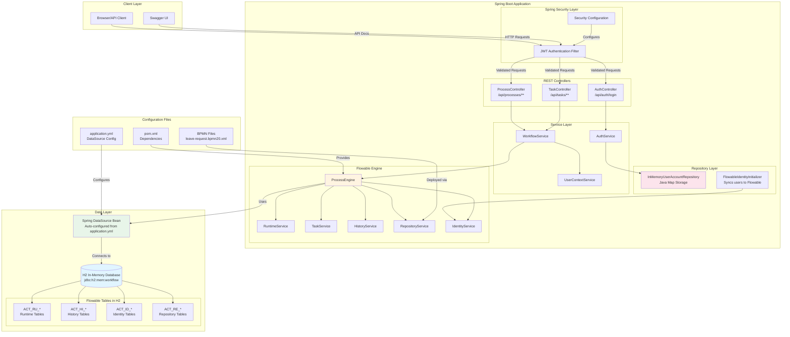
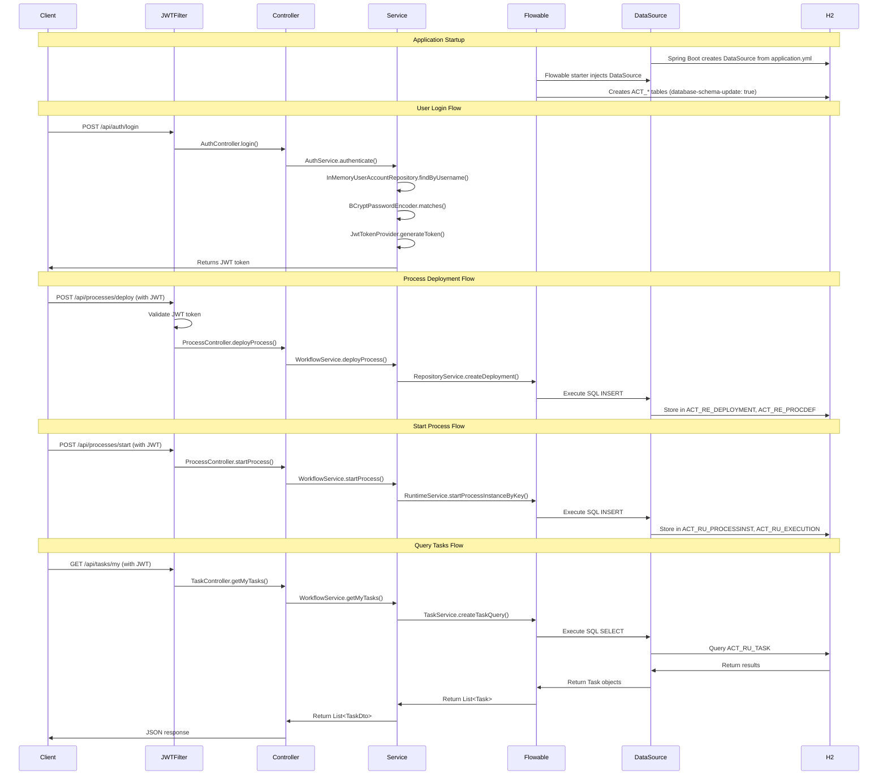
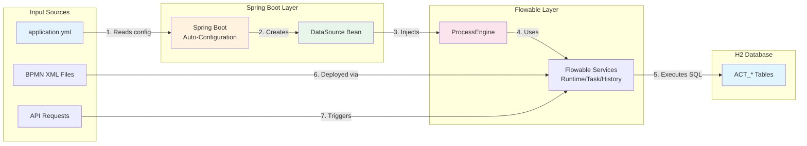
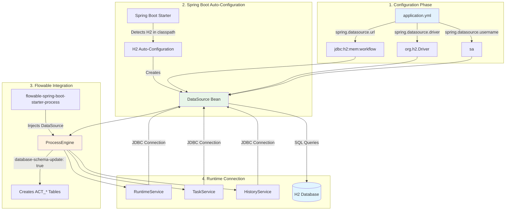
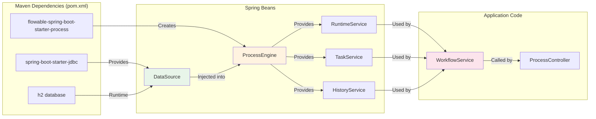

# Architecture Flow Diagram - Java Spring Boot + Flowable BPMN + H2

## System Architecture Flow

## Detailed Component Flow

## Data Flow Diagram

## Connection Details

## Component Dependencies

## Key Points

1. **Spring Boot Auto-Configuration**: Automatically creates DataSource from `application.yml`
2. **Flowable Integration**: Flowable starter injects DataSource into ProcessEngine
3. **Table Creation**: Flowable creates all `ACT_*` tables automatically on startup
4. **No JPA Required**: Uses JDBC directly (no JPA/Hibernate for Flowable)
5. **User Accounts**: Stored in-memory (Java Map), NOT in H2
6. **Connection Pool**: Spring Boot manages connection pool automatically

